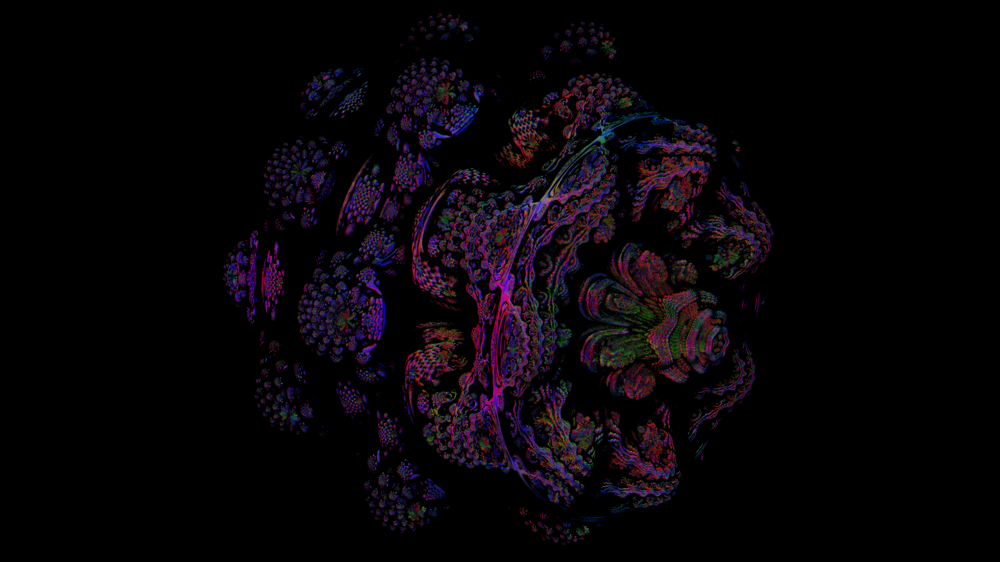

# Graphics library in C++17
This project is useful as a tutorial for those who wish to learn computer graphics. It has basic shader support and also has SDF ray marching.

## Features

* Rasterization
* Color management
* Shaders
* Graphics pipeline
* Framebuffer operations
* Raymarching
* Linear algebra library
  * Vectors and matrices
  * Quaternions
  * Transforms
  * Projections

# Examples

